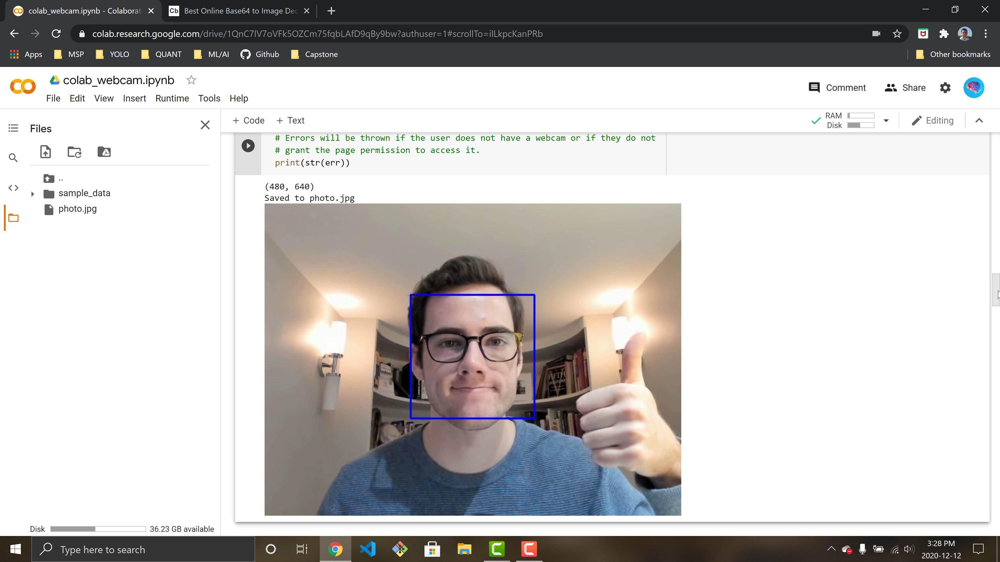

# colab-webcam

Notebook for accessing local webcam within Google Colab on Images and Videos. Basic tutorial running face detection on webcam image and video.

Access Notebook Here: [Link to Notebook](https://colab.research.google.com/drive/1QnC7lV7oVFk5OZCm75fqbLAfD9qBy9bw?usp=sharing)

## Webcam In Google Colab
Accessing your webcam within a Google Colab notebook is not as straightforward as you may think. When you use a Google Colab Runtime you are connecting to a cloud VM hosted by Google. In order to utilize your local machine's webcam within the VM we can utilize JavaScript code.

This tutorial will use OpenCV's pre-trained Haar Cascade Classifier to run face detection on the images and video from our webcam.

To learn more about Haar Cascade you can check out the documentation. [Haar Documentation](https://opencv-python-tutroals.readthedocs.io/en/latest/py_tutorials/py_objdetect/py_face_detection/py_face_detection.html)

### Image Example

### Video Example

Hope you enjoy!
